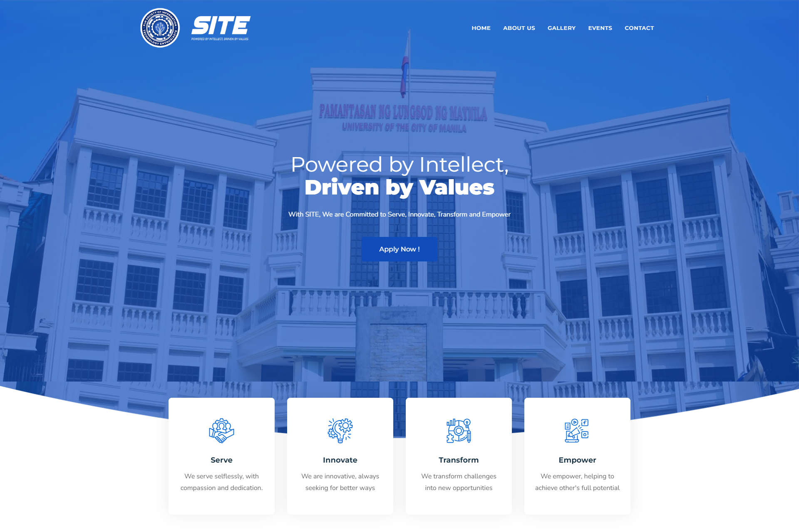

<!-- PROJECT LOGO -->
 

  

    
  

  

    This website project serves as the final requirements for our course Introduction To Computing.
     

<!-- TABLE OF CONTENTS -->

  
<h2 style="display: inline-block">Table of Contents</h2>

  <ol>
    <li>
      <a href="#-about-the-project">About The Project</a>
    </li>
    <li><a href="#-disclaimer">Disclaimer</a></li>
  </ol>

<!-- ABOUT THE PROJECT -->

## 💡 About The Project

This repository contains the source code for PLM - SITE, a website to gain information about PLM Society of Information Technology Enthusiasts. Developed as a submission for our finals project in the course Introduction to Computing, this project showcases our skills in using basic web development tools (HTML, CSS, and Javascript) and our creativity.

### **⚙ Technology Used**

-   HTML
-   CSS
-   JavaScript

## ❗❗ Disclaimer

This project was developed as part of our coursework for Introduction to Computing at Pamantasan ng Lungsod ng Maynila (PLM). It is intended for educational purposes only and the information inside the website may not be up to date.

Updates and Maintenance: This project was created as a one-time submission for a course requirement. As such, we may not actively maintain or update the repository. However, we welcome forks and further development by the community.
